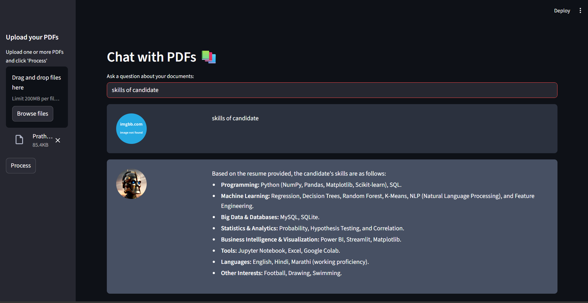
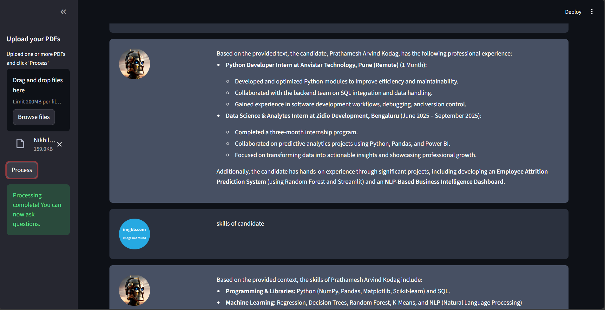

# MultiPDF Chat App

## Introduction
The MultiPDF Chat App is a Python application that allows you to chat with multiple PDF documents. You can ask questions about the PDFs using natural language, and the application will provide relevant responses based on the content of the documents. This app utilizes a language model to generate accurate answers to your queries.

**Note:** The app will only respond to questions related to the loaded PDFs.

---

## How It Works

The application follows these steps to provide responses to your questions:

1. **PDF Loading:** The app reads multiple PDF documents and extracts their text content.  
2. **Text Chunking:** The extracted text is divided into smaller chunks for effective processing.  
3. **Language Model:** The application uses a language model to generate vector representations (embeddings) of the text chunks.  
4. **Similarity Matching:** When you ask a question, the app compares it with the text chunks and identifies the most semantically similar ones.  
5. **Response Generation:** The selected chunks are passed to the language model, which generates a response based on the relevant content of the PDFs.  

---
### Screenshots

**App Interface:**



---

---

## Dependencies and Installation

To install and run the MultiPDF Chat App, follow these steps:

1. Clone the repository to your local machine:
   ```bash
   git clone <repository_url>
````

2. Navigate to the project directory:

   ```bash
   cd <project_directory>
   ```
3. Install the required dependencies:

   ```bash
   pip install -r requirements.txt
   ```
4. Obtain an OpenAI API key and add it to a `.env` file in the project directory:

   ```env
   OPENAI_API_KEY=your_secret_api_key
   ```

---

## Usage

1. Ensure that you have installed the required dependencies and added the OpenAI API key to the `.env` file.
2. Run the app using Streamlit:

   ```bash
   streamlit run app.py
   ```
3. The application will launch in your default web browser, displaying the user interface.
4. Load multiple PDF documents into the app.
5. Ask questions in natural language about the loaded PDFs using the chat interface.

---

Do you want me to do that?
```
